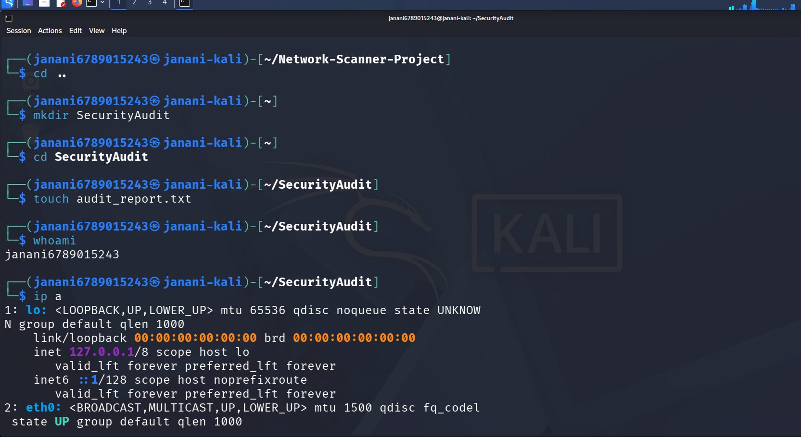
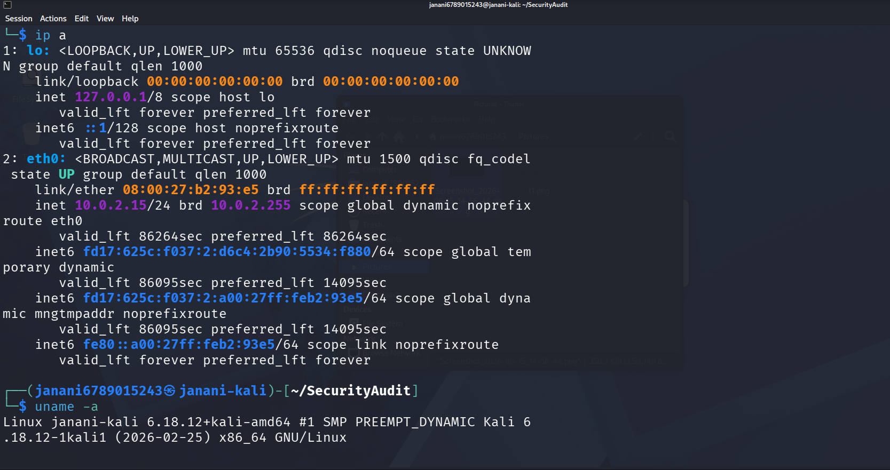
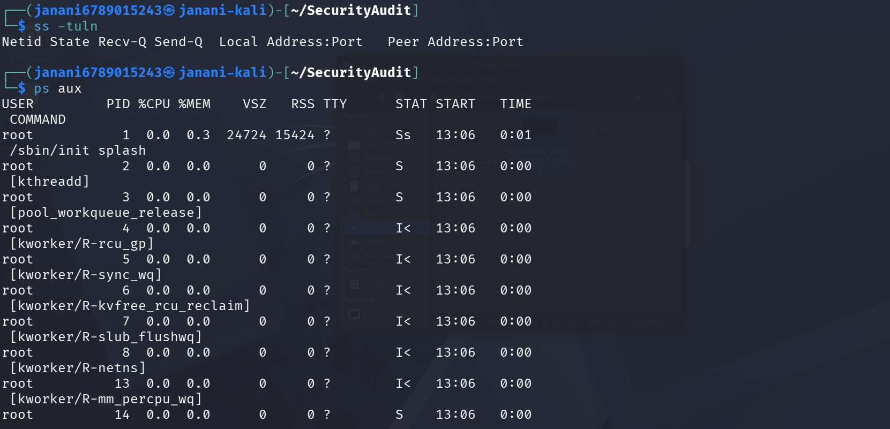
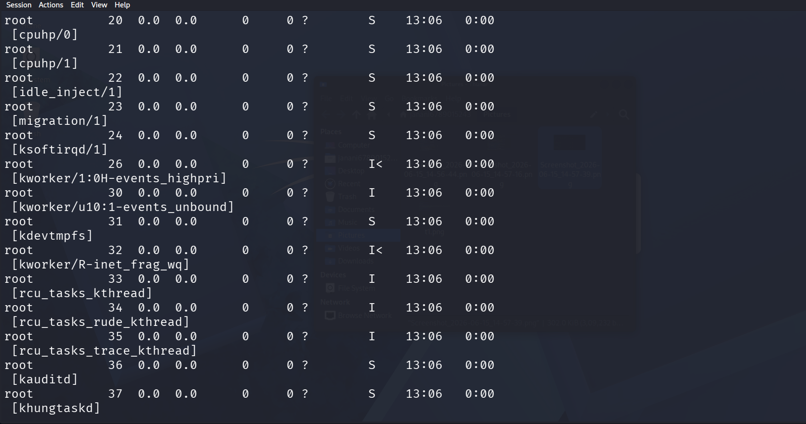
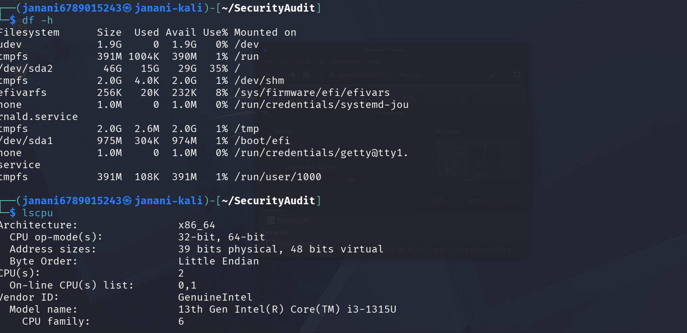

# Linux Security Audit Project

## Objective

Perform a basic Linux security audit using Kali Linux.

## Tools Used

- Kali Linux
- Linux Commands

## Commands Used

- whoami
- uname -a
- hostname
- ip a
- ss -tuln
- ps aux
- free -h
- df -h
- lscpu
- systemctl

## Screenshots

Screenshots are available in the screenshots folder.

## Outcome

Collected and analyzed:
- User information
- System information
- Open ports
- Running services
- Running processes
- Memory usage
- Disk usage
- CPU details

## Conclusion

Successfully completed a basic Linux security audit.
## Screenshots

### Screenshot 1

### Screenshot 2

### Screenshot 3

### Screenshot 4

### Screenshot 5

